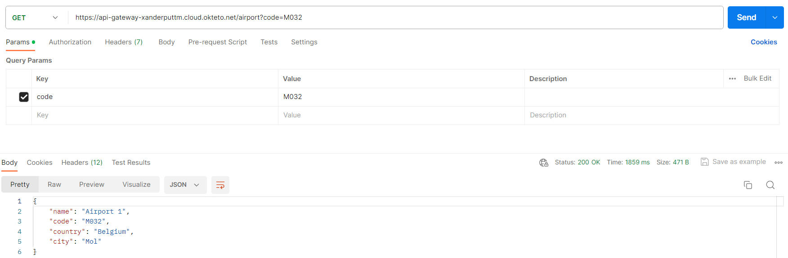

# Documentation Project Enterprise Development Experience

## URLs 🔗

| Name          | URL                                               |
|---------------|---------------------------------------------------|
| `API Gateway` | https://api-gateway-xanderputtm.cloud.okteto.net/ |
| `Prometheus`  | https://prometheus-xanderputtm.cloud.okteto.net/  |
| `Front-end`   | https://microservices-ede.web.app/                |

## Theme
In this project for the course Enterprise Development Experience, we have made an application that makes use of microservices to manage flights and passengers in an airport.
To do this the system consists of four microservices: `airport-service`, `gate-service`, `flight-service` and `passenger-service`. In the next chapter we will take a closer look at the functionalities of these services.

## Microservices and Components

### Airport Service
The airport service exists to manage the airports in our system. The other services make use of airports to see the destination and origin of flights, the airport a gate belongs to, etc.

Airports consist of:
- Name
- Unique airport code
- City & Country

### Gate Service
The gate service exists to manage the gates in our system. The other services make use of gates to see what gate a flight is departing or arriving at.

Gates consist of:
- Gate number
- Airport code of the airport the gate belongs to

### Flight Service
The flight service exists to manage the flights in our system. The passenger service references these flights to assign a passenger to a flight.

Gates consist of:
- Unique flight number
- Airport code of remote airport
- Whether it's a departing / arriving flight
- Code of the gate where this flight is departing/arriving
- Scheduled time of departure/arrival
- Registration number of the plane
- Capacity of the flight

### Passenger Service
The passenger service exists to manage the passengers in our system.
It also hosts some endpoints that are used by the flight-service in certain situations:
- If a flight is updated with a new flight number, the flight service will call an endpoint of the passenger service to also update the flight number of all existing passengers of this flight.
- If a flight is deleted, the flight service will call an endpoint of the passenger service to also delete all existing passengers of this flight.

Passengers consist of:
- Unique PNR Code
- Number of flight they booked
- Seat on flight
- Whether they have checked in
- First and last name
- Nationality
- Birthdate

### API Gateway
The API Gateway serves as the single point where our microservices are exposed to the outside world. The API Gateway then routes the requests to the appropriate microservice. 
This has multiple benefits. 
A few examples are that it makes it easier to implement authentication. 
It also lets us easily monitor incoming traffic and lets us shield the user from backend changes.

### Prometheus
We have chosen to implement Prometheus as an extra component. 
Prometheus monitors the different microservices and api gateway and allows you to query important metrics to determine their health and status.

### Front-end
The front-end website serves as an interface to interact with the microservices in a user-friendly manner.
Users with sufficient access can also use this to interact with the protected endpoints.

## Schema
Below you find a schema that details the connections between the different components:

## Endpoints

### Airport Service

| Endpoint        | Description          | Image                                   |
|-----------------|----------------------|-----------------------------------------|
| `GET /airports` | Get all airports.    |    |
| `GET /airport`  | Get airport by code. |  |

### Gate Service

| Endpoint              | Description                             | Image                                                      |
|-----------------------|-----------------------------------------|------------------------------------------------------------|
| `GET /gates`          | Get all gates.                          |                          |
| `GET /airport/gates`  | Get gates by airportCode.               |                |
| `GET /airport/gate`   | Get gate by airportCode and gateNumber. |    |

### Flight Service

| Endpoint                | Description                    | Image                                             |
|-------------------------|--------------------------------|---------------------------------------------------|
| `GET /flights`          | Get all flights.               |               |
| `GET /flight`           | Get flight by flightNumber.    |     |
| `POST /flight (AUTH)`   | Create flight.                 |                |
| `PUT /flight (AUTH)`    | Update flight by flightNumber. |  |
| `DELETE /flight (AUTH)` | Delete flight by flightNumber. |  |
| `GET /gate/flights`     | Get flights by gateNumber.     |      |

### Passenger Service

| Endpoint                           | Description                                                   | Image                                                                      |
|------------------------------------|---------------------------------------------------------------|----------------------------------------------------------------------------|
| `POST /passenger (AUTH)`           | Create passenger.                                             |                                      |
| `PUT /passenger (AUTH)`            | Update passenger by pnrCode.                                  |                             |
| `DELETE /passenger (AUTH)`         | Delete passenger by pnrCode.                                  |                             |
| `GET /flight/passengers (AUTH)`    | Get all passengers by flightNumber.                           |                          |
| `PUT /flight/passengers (AUTH)`    | Update all passengers by oldFlightNumber and newFlightNumber. |  |
| `DELETE /flight/passengers (AUTH)` | Delete all passengers by flightNumber.                        |                    |